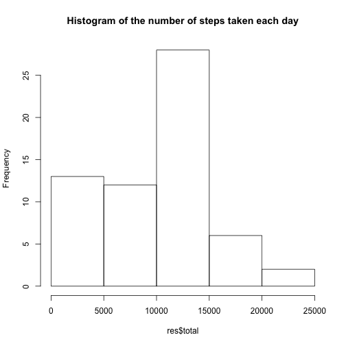

## Introduction
This document describes the steps taken to read, manipulate and anlyse the walking activity of a subject over a period of 2 months.


## Assignment
### Loading and preprocessing the data
In this section we simply load the packages that we will use throughout the analysis and read the input file from a local directory using read.csv


```r
## Read packages
library(dplyr)
library(tidyr)
library(lubridate)
## Read the file from local direcoty
filepath <- "/Users/Greg/DataScience/Reproducible reseach/Week1/"
setwd(filepath)
doc <- read.csv("activity.csv")
## Convert dates from strings to date format
doc <- transform(doc,date=as.Date(date))
```

### What is mean total number of steps taken per day?
For this part we ignore missing values.

1. We start calulating the total number of steps taken per day

```r
res <- group_by(doc,date) %>%
  summarise(total=sum(steps,na.rm=T))
```

2. Then we make a histogram of the total number of steps taken each day


```r
hist(res$total,main="Histogram of the number of steps taken each day")
```



3. Finally we look at the mean and median of the total number of steps taken per day

```r
meansteps <- mean(res$total)
mediansteps <- median(res$total)
print(paste("Mean:",meansteps,"Median:",mediansteps))
```

```
## [1] "Mean: 9354.22950819672 Median: 10395"
```


### What is the average daily activity pattern?
1. We make a time series plot of the 5-minute interval and the average number of steps taken, averaged across all days
For this we first group data by interval, and then create a simple plot with base package

```r
res_int <- group_by(doc,interval) %>%
  summarise(avg=mean(steps,na.rm=T))
plot(res_int,type="l",main="Average number of steps per 5-minute interval")
```


2. Which 5-minute interval, on average across all the days in the dataset, contains the maximum number of steps?

```r
max=which.max(res_int$avg)
res_int$interval[max]
```

```
## [1] 835
```


### Imputing missing values
There are a number of days/intervals where there are missing values (coded as 𝙽𝙰). The presence of missing days may introduce bias into some calculations or summaries of the data.
1. How many missing values do we have in the dataset? 

```r
sum(is.na(doc$steps))
```

```
## [1] 2304
```
2. Let's devise a strategy for filling in all of the missing values in the dataset. 

One simple way to fill in missing value is to replace them by the mean value of steps for this time interval. For convenience we round to an integer value. 

3. We create a new dataset that is equal to the original dataset but with the missing data filled in.

```r
doc2 <- doc
for (i in 1:length(doc2$steps)){
  if (is.na(doc2$steps[i])) doc2$steps[i] <- ceiling(subset(res_int,interval==doc2$interval[i])$avg)
}
```
4. Now we make a new histogram of the number of steps taken each day with the new dataset
First we will group data by date, and the display it with a histogram.

```r
res2 <- group_by(doc2,date) %>%
  summarise(total=sum(steps,na.rm=T))
hist(res2$total,main="Histogram of the number of steps taken each day")
```


Let's calculate again the mean and median, and compare them to previous values

```r
meansteps2 <- mean(res2$total)
mediansteps2 <- median(res2$total)
print(paste("New mean:",meansteps2,"New median:",mediansteps2))
```

```
## [1] "New mean: 10784.9180327869 New median: 10909"
```
What we observe is that the mean increases from 9354 to 10784, and the median increases from 10395 to 10909.


### Are there differences in activity patterns between weekdays and weekends?
1. We create a new factor variable in the dataset with two levels – “weekday” and “weekend” indicating whether a given date is a weekday or weekend day.

```r
week <- function(d){
  daytype<-vector()
  for (i in 1:length(d))
  if(weekdays(as.Date(d[i])) %in% c("Dimanche","Samedi")) 
    {daytype[i]<-"weekend"} 
  else {daytype[i]<-"weekdays"}
  daytype
}
doc2 <- mutate(doc2,daytype=as.factor(week(date)))
```

2. Now we display the data for each category in two separate graphs

```r
res3 <- group_by(doc2,daytype,interval) %>%
  summarise(avg=mean(steps))
par(mfrow=c(2,1),mar=c(2,2,2,1))
with(subset(res3,daytype=="weekdays"),
  plot(x=interval,y=avg,type="l",ylim = c(0,250))
)
title("Weekdays")
with(subset(res3,daytype=="weekend"),
  plot(x=interval,y=avg,type="l",ylim = c(0,250))
)
title("Weekends")
```


